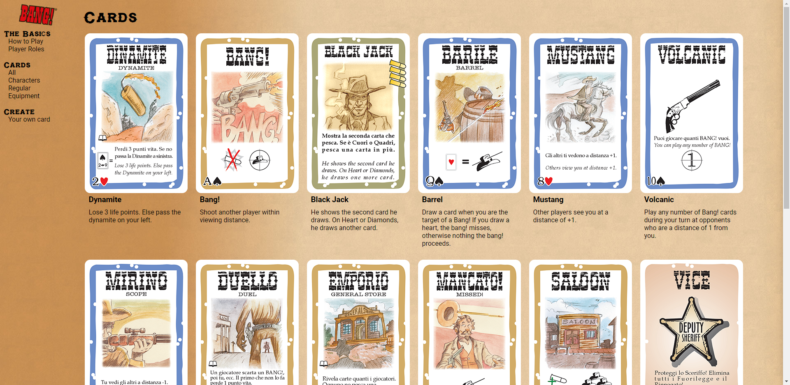

# BANG! Card Game, Card Inventory App

<a href="https://inventory-app-382119.wl.r.appspot.com/cards/all" target="_blank">See it live!</a>

## Table of Contents

- [BANG! Card Game, Card Inventory App](#bang-card-game-card-inventory-app)
  - [Table of Contents](#table-of-contents)
  - [Project Information](#project-information)
  - [Features](#features)
  - [Packages, Frameworks, and Technology](#packages-frameworks-and-technology)

## Project Information

Card inventory application based on the board game, Bang!

- Built around the MVC architectural design pattern.
- All card information is stored on MongoDB Atlas, and pulled via api REST request.
- Reusable EJS templates created for individual cards and category views
- Reusable partials created for header, footer, navigation, and site body.

## Features

- Users can create their own card. A document within the corresponding mongoDB collection is generated to store the information.

## Packages, Frameworks, and Technology

- [Axios](https://axios-http.com/docs/intro)
- [CSS3](https://devdocs.io/css/)
- [Dotenv](https://www.npmjs.com/package/dotenv)
- [Ejs](https://ejs.co/)
- [Express](https://expressjs.com/)
- [Font Awesome](https://fontawesome.com/)
- [Google Cloud, App Engine](https://cloud.google.com/appengine)
- [HTML5](https://devdocs.io/html/)
- [Javascript](https://www.javascript.com/)
- [Mongoose](https://mongoosejs.com/)
- [MongoDB Atlas](https://www.mongodb.com/atlas/database)
- [NodeJS](https://nodejs.org/en/docs/)
- [NPM](https://docs.npmjs.com/)
